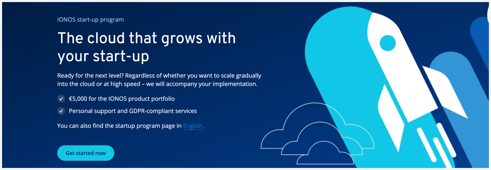

# IONOS Cloud FAQs

<figure><figcaption></figcaption></figure>

Get answers to the most commonly encountered questions.

You can [<mark style="color:blue;">sign up</mark>](https://cloud.ionos.com/compute/signup) to get started with your trial account.

## Questions

### Account Settings

<table data-view="cards">
  <thead>
    <tr>
      <th></th>
      <th></th>
      <th data-hidden data-card-target data-type="content-ref"></th>
    </tr>
  </thead>
  <tbody>
    <tr>
      <td><mark style="color:blue;"><strong>How can I recover my password?</strong></mark></td>
      <td>Learn how to reset your password if you've forgotten it.</td>
      <td><a href="general-information/frequently-asked-questions/account-settings.md#how-can-i-recover-my-password">how-can-i-recover-my-password</a></td>
    </tr>
    <tr>
      <td><mark style="color:blue;"><strong>How can I update my email address?</strong></mark></td>
      <td>Steps to update the email address associated with your account.</td>
      <td><a href="general-information/frequently-asked-questions/account-settings.md#how-can-i-update-my-email-address">how-can-i-update-my-email-address</a></td>
    </tr>
    <tr>
      <td><mark style="color:blue;"><strong>Do I need a verification code to log in to IONOS Cloud account?</strong></mark></td>
      <td>Understand when and why a verification code is required for login.</td>
      <td><a href="general-information/frequently-asked-questions/account-settings.md#do-i-need-a-verification-code-to-log-in-to-ionos-cloud-account">do-i-need-a-verification-code-to-log-in-to-ionos-cloud-account</a></td>
    </tr>
    <tr>
      <td><mark style="color:blue;"><strong>How do I delete my account?</strong></mark></td>
      <td>Find out the process for permanently deleting your account.</td>
      <td><a href="general-information/frequently-asked-questions/account-settings.md#how-do-i-delete-my-account">how-do-i-delete-my-account</a></td>
    </tr>
  </tbody>
</table>

### Compute Engine

<table data-view="cards">
  <thead>
    <tr>
      <th></th>
      <th></th>
      <th data-hidden data-card-target data-type="content-ref"></th>
    </tr>
  </thead>
  <tbody>
    <tr>
      <td><mark style="color:blue;"><strong>What are Cloud Servers?</strong></mark></td>
      <td>Discover the features and benefits of IONOS Cloud Servers.</td>
      <td><a href="general-information/frequently-asked-questions/compute-engine.md#what-are-cloud-servers">what-are-cloud-servers</a></td>
    </tr>
    <tr>
      <td><mark style="color:blue;"><strong>How can I change the data center location?</strong></mark></td>
      <td>Instructions on how to modify the location of your data center.</td>
      <td><a href="general-information/frequently-asked-questions/compute-engine.md#how-can-i-change-the-data-center-location">how-can-i-change-the-data-center-location</a></td>
    </tr>
    <tr>
      <td><mark style="color:blue;"><strong>How can I find the location of my data center?</strong></mark></td>
      <td>Learn how to identify the physical location of your data center.</td>
      <td><a href="general-information/frequently-asked-questions/compute-engine.md#how-can-i-find-the-location-of-my-data-center">how-can-i-find-the-location-of-my-data-center</a></td>
    </tr>
    <tr>
      <td><mark style="color:blue;"><strong>Why I cannot access my VM via Remote Console?</strong></mark></td>
      <td>Troubleshooting tips for accessing your virtual machine remotely.</td>
      <td><a href="general-information/frequently-asked-questions/compute-engine.md#why-can-i-not-access-my-virtual-machine-vm-via-the-remote-console">why-can-i-not-access-my-vm-via-remote-console</a></td>
    </tr>
  </tbody>
</table>

[<mark style="color:blue;">Get started now</mark>](https://cloud.ionos.de/startup-programm#contact) to learn more about the IONOS Cloud Startup Initiative.

### Costs & Billing

<table data-view="cards">
  <thead>
    <tr>
      <th></th>
      <th></th>
      <th data-hidden data-card-target data-type="content-ref"></th>
    </tr>
  </thead>
  <tbody>
    <tr>
      <td><mark style="color:blue;"><strong>From where can I download my invoices?</strong></mark></td>
      <td></td>
      <td><a href="general-information/frequently-asked-questions/costs-and-billing.md#from-where-can-i-download-my-invoices">from-where-can-i-download-my-invoices</a></td>
    </tr>
    <tr>
      <td><mark style="color:blue;"><strong>Can I limit my costs?</strong></mark></td>
      <td></td>
      <td><a href="general-information/frequently-asked-questions/costs-and-billing.md#can-i-limit-my-costs">can-i-limit-my-costs</a></td>
    </tr>
    <tr>
      <td><mark style="color:blue;"><strong>Can I calculate my costs in advance?</strong></mark></td>
      <td></td>
      <td><a href="general-information/frequently-asked-questions/costs-and-billing.md#can-i-calculate-my-expenses-in-advance">can-i-calculate-my-expenses-in-advance</a></td>
    </tr>
    <tr>
      <td><mark style="color:blue;"><strong>How is the traffic measured and billed?</strong></mark></td>
      <td></td>
      <td><a href="general-information/frequently-asked-questions/costs-and-billing.md#how-is-the-traffic-measured-and-billed">how-is-the-traffic-measured-and-billed</a></td>
    </tr>
    <tr>
      <td><mark style="color:blue;"><strong>Do you offer discounts on contracts?</strong></mark></td>
      <td></td>
      <td><a href="general-information/frequently-asked-questions/costs-and-billing.md#do-you-offer-discounts-on-contracts">do-you-offer-discounts-on-contracts</a></td>
    </tr>
  </tbody>
</table>

### Data Center Designer

<table data-view="cards">
  <thead>
    <tr>
      <th></th>
      <th></th>
      <th data-hidden data-card-target data-type="content-ref"></th>
    </tr>
  </thead>
  <tbody>
    <tr>
      <td><mark style="color:blue;"><strong>How do I connect to a server via DCD?</strong></mark></td>
      <td></td>
      <td><a href="general-information/frequently-asked-questions/data-center-designer.md#how-do-i-connect-to-a-server-using-the-dcd">how-do-i-connect-to-a-server-using-the-dcd</a></td>
    </tr>
    <tr>
      <td><mark style="color:blue;"><strong>How do I manage user permissions?</strong></mark></td>
      <td></td>
      <td><a href="general-information/frequently-asked-questions/data-center-designer.md#how-do-i-manage-user-permissions">how-do-i-manage-user-permissions</a></td>
    </tr>
    <tr>
      <td><mark style="color:blue;"><strong>How are user privileges assigned?</strong></mark></td>
      <td></td>
      <td><a href="general-information/frequently-asked-questions/data-center-designer.md#how-are-user-privileges-assigned">how-are-user-privileges-assigned</a></td>
    </tr>
    <tr>
      <td><mark style="color:blue;"><strong>How is provisioning conducted?</strong></mark></td>
      <td></td>
      <td><a href="general-information/frequently-asked-questions/data-center-designer.md#how-is-provisioning-conducted">how-is-provisioning-conducted</a></td>
    </tr>
  </tbody>
</table>

### General Inquiries

<table data-view="cards">
  <thead>
    <tr>
      <th></th>
      <th></th>
      <th data-hidden data-card-target data-type="content-ref"></th>
    </tr>
  </thead>
  <tbody>
    <tr>
      <td><mark style="color:blue;"><strong>How can I ensure my data center is properly set up?</strong></mark></td>
      <td></td>
      <td><a href="general-information/frequently-asked-questions/general-inquiries.md#how-can-i-ensure-my-data-center-is-properly-set-up">how-can-i-ensure-my-data-center-is-properly-set-up</a></td>
    </tr>
    <tr>
      <td><mark style="color:blue;"><strong>Do you guarantee that my data will only remain in Germany?</strong></mark></td>
      <td></td>
      <td><a href="general-information/frequently-asked-questions/general-inquiries.md#do-you-guarantee-that-my-data-will-only-remain-in-germany">do-you-guarantee-that-my-data-will-only-remain-in-germany</a></td>
    </tr>
    <tr>
      <td><mark style="color:blue;"><strong>Does IONOS Cloud offer specific certifications?</strong></mark></td>
      <td></td>
      <td><a href="general-information/frequently-asked-questions/general-inquiries.md#does-ionos-cloud-offer-specific-certifications">does-ionos-cloud-offer-specific-certifications</a></td>
    </tr>
    <tr>
      <td><mark style="color:blue;"><strong>Who should I contact if I want to transfer my account to another company?</strong></mark></td>
      <td></td>
      <td><a href="general-information/frequently-asked-questions/general-inquiries.md#who-should-i-contact-if-i-want-to-transfer-my-account-to-another-company">who-should-i-contact-if-i-want-to-transfer-my-account-to-another-company</a></td>
    </tr>
    <tr>
      <td><mark style="color:blue;"><strong>Who should I contact if I need an AVV or NDA?</strong></mark></td>
      <td></td>
      <td><a href="general-information/frequently-asked-questions/general-inquiries.md#who-should-i-contact-if-i-need-an-auftragsverarbeitungsvertrag-avv">who-should-i-contact-if-i-need-an-avv</a></td>
    </tr>
  </tbody>
</table>

### Payment Options

<table data-view="cards">
  <thead>
    <tr>
      <th></th>
      <th></th>
      <th data-hidden data-card-target data-type="content-ref"></th>
    </tr>
  </thead>
  <tbody>
    <tr>
      <td><mark style="color:blue;"><strong>Which payment methods are available in the DCD?</strong></mark></td>
      <td></td>
      <td><a href="general-information/frequently-asked-questions/payment-options.md#which-payment-methods-are-available-in-the-dcd">which-payment-methods-are-available-in-the-dcd</a></td>
    </tr>
    <tr>
      <td><mark style="color:blue;"><strong>How can I update my email address?</strong></mark></td>
      <td></td>
      <td><a href="general-information/frequently-asked-questions/account-settings.md#how-can-i-update-my-email-address">how-can-i-update-my-email-address</a></td>
    </tr>
    <tr>
      <td><mark style="color:blue;"><strong>Do I need a verification code to log in to IONOS Cloud account?</strong></mark></td>
      <td></td>
      <td><a href="general-information/frequently-asked-questions/account-settings.md#do-i-need-a-verification-code-to-log-in-to-ionos-cloud-account">do-i-need-a-verification-code-to-log-in-to-ionos-cloud-account</a></td>
    </tr>
    <tr>
      <td><mark style="color:blue;"><strong>How do I delete my account?</strong></mark></td>
      <td></td>
      <td><a href="general-information/frequently-asked-questions/account-settings.md#how-do-i-delete-my-account">how-do-i-delete-my-account</a></td>
    </tr>
  </tbody>
</table>

### Trial Conditions

<table data-view="cards">
  <thead>
    <tr>
      <th></th>
      <th></th>
      <th data-hidden data-card-target data-type="content-ref"></th>
    </tr>
  </thead>
  <tbody>
    <tr>
      <td><mark style="color:blue;"><strong>Why should I create a test account?</strong></mark></td>
      <td></td>
      <td><a href="general-information/frequently-asked-questions/trial-conditions.md#why-should-i-create-a-test-account">why-should-i-create-a-test-account</a></td>
    </tr>
    <tr>
      <td><mark style="color:blue;"><strong>What happens after I create a test account?</strong></mark></td>
      <td></td>
      <td><a href="general-information/frequently-asked-questions/trial-conditions.md#what-happens-after-i-create-a-test-account">what-happens-after-i-create-a-test-account</a></td>
    </tr>
    <tr>
      <td><mark style="color:blue;"><strong>Can I observe my trial resource usage?</strong></mark></td>
      <td></td>
      <td><a href="general-information/frequently-asked-questions/trial-conditions.md#can-i-observe-my-trial-resource-usage">can-i-observe-my-trial-resource-usage</a></td>
    </tr>
    <tr>
      <td><mark style="color:blue;"><strong>Which resources are available during the trial period?</strong></mark></td>
      <td></td>
      <td><a href="general-information/frequently-asked-questions/trial-conditions.md#which-resources-are-available-during-the-trial-period">which-resources-are-available-during-the-trial-period</a></td>
    </tr>
  </tbody>
</table>
